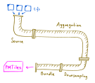
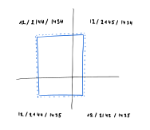
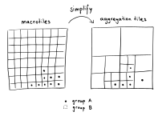
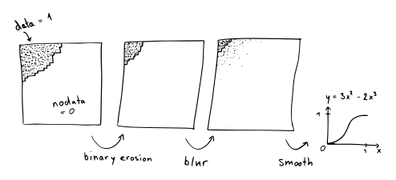

# Mapterhorn Pipelines

Mapterhorn has four main pipelines that run in sequence: Source, Aggregation, Downsampling, and Bundle. The input is a set of tifs containing elevation data and the output are PMTiles files with terrain RGB.



## Source

The source pipeline has two parts: download and bounds. 

In **download**, we take as the file_list.txt of a given source and download all the files from the internet to the local machine. The images are stored in `source-store/{source}/`.

It is recommended to store the main repository on an SSD for fast random access, but to allow for large enough storage one can map the source-store subfolders with softlinks to mounted HDD folders. 

Example: 

`source-store/swissalti3d -> /mnt/hdd1/source-store/swissalti3d`

In **bounds**, we iterate over all the image files of a given source and query the bounding box of the image in web mercator coordinates epsg:3857, the coordinate reference system (crs), and the size in pixels. We write this information into a csv file with one line per source image. This file is located at source-store/{source}/bounds.csv.

The source pipeline has to be executed on every source separately and runs single-threaded.


## Aggregation

The aggregation pipeline converts the source images to terrain RGB PMTiles files without overviews. All data is reprojected to web mercator, sources are merged with smooth edge blending, and the maxzoom is locally adjusted to fully resolve the source data.

The pipeline has two main parts. First, we plan what needs to be done. This part is called **covering**. Second, we execute the work. This part is called **run**.

In **covering**, we loop over all source bounds.csv files and all source files (or items) in the bounds file. We buffer the source item bounding box and compute which z12 tiles it intersects:



These zoom 12 tiles are called "macrotiles". We then store in a map which macrotiles intersect which source items.

For every source item we furthermore compute the smallest web mercator zoom level to oversample the source data. Here is where we use the pixel size and bounding box from the bounds.csv file.

Throughout Mapterhorn we assume a final tile size of 512 by 512 pixels. Intermediate working tiles can also be larger but never smaller.

Once we have the macrotile to source item map, we group macrotiles by maxzoom, source, and crs. That is, if two macrotiles have source items with the same set of sources, maxzooms, and crses, they will be in the same group.

Now that every macrotile is assigned to a group we go ahead and turn macrotiles into what we call "aggregation tiles" by simplifying macrotiles of equal group:



We limit how large aggregation tiles can be by requiring that their maxzoom to extent zoom difference is not more than 6. This means that an aggregation tile can be at most 64*512=32768 pixels wide. With float32 elevation data this yields roughly 4 gigabytes of uncompressed data.

The aggregation tiles are then written to aggregation csv files containing the work instructions, i.e., which source items to use and at what zoom level they should be reprojected. We store those in paths of the form `aggregation-store/{aggregation_id}/{z}-{x}-{y}-{child_z}-aggregation.csv`

The aggregation_id is generated automatically each time the covering is executed. The aggregation tile extent is given by z, x, and y and child_z is the zoom level at which the source items should be sampled.

In the file we find a list of file names, sources, crses, and maxzooms. Example `11-1078-718-17-aggregation.csv`:

```
source,filename,crs,maxzoom
glo30,Copernicus_DSM_COG_10_N47_00_E009_00_DEM.tif,EPSG:4326,12
swissalti3d,swissalti3d_2019_2755-1227_0.5_2056_5728.tif,EPSG:2056,17
swissalti3d,swissalti3d_2019_2755-1230_0.5_2056_5728.tif,EPSG:2056,17
...
```

In **run**, we iterate over all aggregation items of the latest aggregation id and execute them.

If an item is identical to the corresponding one of the second-latest aggregation, then it can be skipped as nothing has changed since last time. Like this we can add, update, and remove sources without having to recompute the full planet each time.

Else we need to process the aggregation item. For this we first copy all relevant source image files from the source folder, which potentially is on a HDD, to a folder in the aggregation store, which we recommend is on an SSD because we need fast random access from multiple concurrent threads.

Then we group the source items by source, maxzoom, and crs and order them such that higher maxzoom is more important than lower, and earlier lexicographic names are more important than later.

We iterate over the source item groups starting with the most important one and do the following:

1. Call gdal to make a virtual raster (vrt) of all source images
2. Call gdal to warp the vrt to web mercator. Here is where we need to crses
3. Call gdal to reproject the data
4. Check with rasterio if the resulting tif has nodata pixels. Break if not, else continue with the next source item group.

Now that we have reprojected the data to web mercator, we need to merge the tifs of different source item groups.

If there is only a single tif, nothing needs to be done.

If there are multiple ones, loop through them by priority with the most important first. For each tif, read the data into a 2d array called "new" and apply the following steps to create an alpha mask for additive blending based on the data of the last iteration which is stored in "old":

1. Create a binary mask with 1 = has data and 0 = nodata
2. Use binary erosion to make the data area smaller. The number of iterations is proportional to the buffer size
3. Blur to get a gentle transition between 1 and 0
4. Apply a further smooth step to decrease the gradients close to 0 and 1



Use now the resulting alpha mask to additively blend new into old:

`old = old * alpha_mask + new * (1 - alpha_mask)`

Then check if old still contains nodata pixels, if so continue, else break the loop.

In practice, the above method means that we paint better quality data on top of lower quality data and we transition between the datasets by eating a little into the higher quality data.

After having reprojected and merged the source data, we now have a tif that contains the aggregated data. What remains to be done in the aggregation pipeline is to store it as PMTiles. We use terrarium encoding since it has a finer resolution than mapbox encoding. Data is stored as webp RGB images which are  25 to 35 percent smaller than PNGs but they take longer to encode.

We store the PMTiles data in the pmtiles-store folder using the same filename convention as the aggregation csv but just without the "-aggregation".

If the aggregation item has z &lt; 7, it is stored directly in the pmtiles-store folder. Else it is placed in a subfolder where the subfolder name is given by the zoom 7 parent of the aggregation item. Example: `pmtiles-store/7-67-44/12-2144-1434-17.pmtiles`

The idea behind the zoom 7 parent folders is that they can be linked to folders on an HDD. Example:

`pmtiles-store/7-67-44 -> /mnt/hdd1/pmtiles-store/7-67-44`

Note on parallelism: the aggregation pipeline is parallelized in all parts, but the merging part requires roughly 20 gigabytes of memory per thread which on most systems will mean that only a few threads can merge in parallel. Reprojection and conversion to PMTiles on the other hand have memory footprints well below 1 gigabyte per thread and should reach high cpu utilization.


## Downsampling

The downsampling pipeline creates overviews from the aggregated PMTiles file which contain only data at the local maxzoom. The pipeline has again two parts: **covering** to plan the work, and **run** to execute the work.

In **covering**, we iterate over zoom levels starting with the highest and going lower down to zero. For a given zoom, we read all aggregation item extents and all previously produced downsampling extents, and simplify them again up to a total downsampling tile width of 64 * 512 = 32768 pixels. For each parent downsampling item we write which children are involved into a file at `aggregation-store/{aggregation_id}/{z}-{x}-{y}-{child_z}-downsampling.csv`. 

Example content of `2-0-0-2-downsampling.csv`:

```
filename
3-1-1-3.pmtiles
3-0-1-3.pmtiles
3-1-0-3.pmtiles
```

In **run**, we iterate over all downsampling items in descending child zoom order and we first check if the involved aggregation items have changed since the last aggregation. If not, we can skip this item. Else process it as follows:

First we create a map from child tile id to pmtiles file by expanding the children of each file. Then, for each parent tile we get the 4 children to fill a 1024 by 1024 float32 array. We half the size to 512 by 512 using 2 by 2 averaging. The tiles are then encoded as terrarium again and written as webp to disk. Then we pack the webps into a pmtiles archive and store it in the pmtiles-store folder with the same file location convention as for aggregation items.

Note that also in downsampling we only store a single zoom level per PMTiles file. The downsampling pipeline is fully parallelized and has a low memory footprint as well as high cpu utilization.


## Bundle

The last task is to bundle the single zoom level PMTiles files from aggregation and downsampling using the bundle pipeline.

The pmtiles-store folder contains thousands of files after aggregation and downsampling. They all have a single zoom level of tiles and they are at most 64 tiles wide, which means that their size can be at most around 1 gigabyte.

We now bundle these files by creating tile pyramids with multiple zoom levels. Ideally, Mapterhorn would be distributed as a single PMTiles file, but typical object storage is limited to 5 terabytes per object and already with copernicus glo30 and swissalti3d only the total size is 1.4 terabytes. Therefore, we need to split the data into multiple files and this is done as follows:

**planet.pmtiles** contains all tiles from zoom 0 to zoom 12.

**6-{x}-{y}.pmtiles** contains all zoom level 13+ children of tile 6-{x}-{y}.

With this convention we can limit the total file size to roughly 1 terabyte assuming that we have a maxzoom of 17 which corresponds to about 0.5 m resolution.

## Requirements

- uv: `curl -LsSf https://astral.sh/uv/install.sh | sh`
- tippecanoe: https://github.com/felt/tippecanoe?tab=readme-ov-file#installation
- gdal: https://mothergeo-py.readthedocs.io/en/latest/development/how-to/gdal-ubuntu-pkg.html#install-gdal-ogr

## Debug

Run `./debug.sh`. This should download one image of swissalti3d and one of glo30, reproject them to web mercator, aggregate and downsample, and bundle them in two pmtiles files in the bundle store.

